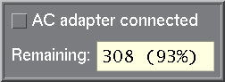
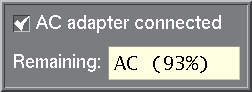

# DtApm
Simple GUI battery monitor for OpenBSD, Motif and Common Desktop Environment. You need to have Motif installed, and you just type `make` to build it. Toss the executable file wherever you like.

